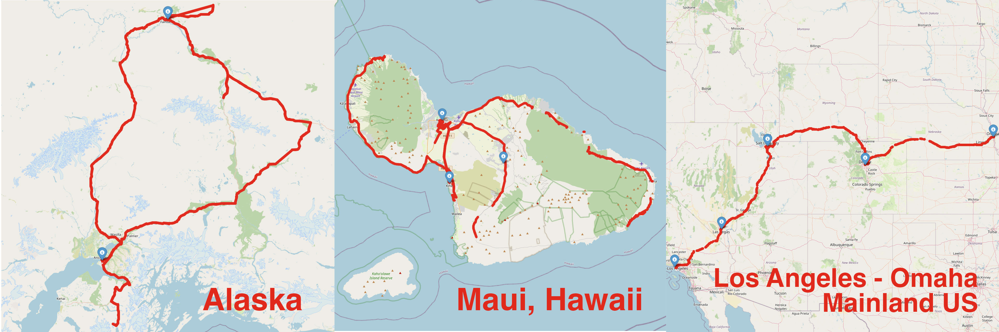

# [SIGMETRICS '26] Exploring the 5G Digital Divide in the Non-Contiguous US: LEO Satellites to the Rescue?



In this repository, we release the dataset and scripts used in the SIGMETRICS '26 paper, *Exploring the 5G Digital Divide in the Non-Contiguous US: LEO Satellites to the Rescue?*

**Authors**:
[[Sizhe Wang](https://sizhewang.cn)]
[[Moinak Ghoshal](https://sites.google.com/view/moinak-ghoshal/home)]
[[Yufei Feng](https://www.linkedin.com/in/yufei-feng-7b268820b)]
[[Imran Khan](https://imranbuet63.github.io)]
[[Phuc Dinh](https://scholar.google.com/citations?user=87M0_7EAAAAJ&hl=en)]
[[Omar Basit](https://scholar.google.com/citations?user=O8YhcToAAAAJ&hl=en)]
[[Zhekun Yu](https://www.linkedin.com/in/zhekun-yu-444a962a8/)]
[[Y. Charlie Hu](https://engineering.purdue.edu/~ychu/)]
[[Dimitrios Koutsonikolas](https://ece.northeastern.edu/fac-ece/dkoutsonikolas/)]

---

## Prerequisites

Python: >= 3.12

Install the required Python dependencies:
```bash
pip install -r requirements.txt
```

---

## Data Access

The dataset files are stored using **Git LFS** (Large File Storage). After cloning the repository, use the following command to download the large dataset files:

```bash
# Clone the repository
git clone https://github.com/NUWiNS/sigmetrics26-exploring-the-5g-digital-divide-in-the-non-contiguous-us-leo-satellites-to-the-rescue.git
cd sigmetrics26-exploring-the-5g-digital-divide-in-the-non-contiguous-us-leo-satellites-to-the-rescue

# Download large files tracked by Git LFS
git lfs pull

# Unzip all compressed tar files
tar -xzvf alaska_road_test_202406.processed.tar.gz
tar -xzvf hawaii_road_test_202408.processed.tar.gz
tar -xzvf la_to_omaha_road_test_202411.processed.tar.gz
```

If you don't have Git LFS installed:
```bash
# macOS
brew install git-lfs

# Ubuntu/Debian
sudo apt-get install git-lfs

# Initialize Git LFS
git lfs install
```

---

## Repository Structure & Usage

- **`datasets/`**
  Contains the measurement data collected from road tests across multiple locations:
  - `alaska_road_test_202406/` — Alaska road test data (June 2024)
  - `hawaii_road_test_202408/` — Hawaii road test data (August 2024)
  - `la_to_omaha_road_test_202411/` — LA to Omaha road test data (November 2024)

- **`scripts/`**
  Contains utility modules and plotting scripts:
  - **`plotting/`** — Scripts to generate all figures in the paper:
    - `fig2_tput_with_cc_and_buffer/` — Throughput with congestion control and buffer
    - `fig3_cell_tech_distribution/` — Cellular technology distribution
    - `fig6_cell_kpis_across_loc/` — Cellular KPIs across locations
    - `fig7_cell_rb_alaska/` — Cellular resource blocks in Alaska
    - `fig8_cell_tcp_dl_with_areas/` — Cellular TCP downlink throughput CDF by area
    - `fig9_cell_tcp_ul_with_areas/` — Cellular TCP uplink throughput CDF by area
    - `fig10_cell_icmp_latency_with_areas/` — Cellular ICMP RTT CDF by area
    - `fig12_starlink_network_kpis_across_locations/` — Starlink network KPIs across locations
    - `fig13_starlink_network_kpis_with_areas/` — Starlink network KPIs by area
    - `fig14_starlink_outage/` — Starlink outage analysis
    - `fig15_starlink_cell_network_kpis_in_non_contiguous/` — Starlink vs Cellular in non-contiguous US
    - `fig16_starlink_cell_network_kpis_with_areas_in_non_contiguous/` — Starlink vs Cellular by area
    - `fig17_delta_tput_between_operators/` — Throughput delta between operators
    - `tab1_concurrent_outage/` — Analysis of concurrent outage between operators (Table 1)

---

## Plotting

```
cd scripts/plotting

# Output will be placed locally in the folder
python <fig-folder-name>/main.py
```

---

## Citation

If you find this dataset useful in your research, please cite our paper:

```bibtex

@article{wang:sigmetrics2026,
author = {Wang, Sizhe and Ghoshal, Moinak and Feng, Yufei and Khan, Imran and Dinh, Phuc and Basit, Omar and Yu, Zhekun and Hu, Y. Charlie and Koutsonikolas, Dimitrios},
title = {Exploring the 5G Digital Divide in the Non-Contiguous US: LEO Satellites to the Rescue?},
journal = {Proc. ACM Meas. Anal. Comput. Syst.},
year = {2025}
}
```

---

## Contact

If you have any questions, feel free to contact [Sizhe Wang @ Northeastern University](mailto:wang.sizh@northeastern.edu).
