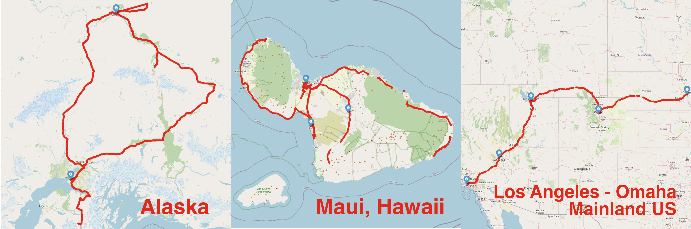

# [SIGMETRICS '26] Exploring the 5G Digital Divide in the Non-Contiguous US: LEO Satellites to the Rescue?



In this repository, we release the dataset and scripts used in the SIGMETRICS '26 paper, *[Exploring the 5G Digital Divide in the Non-Contiguous US: LEO Satellites to the Rescue?](https://dl.acm.org/doi/abs/10.1145/3771568)*

**Authors**:
[[Sizhe Wang](https://sizhewang.cn)]
[[Moinak Ghoshal](https://sites.google.com/view/moinak-ghoshal/home)]
[[Yufei Feng](https://www.linkedin.com/in/yufei-feng-7b268820b)]
[[Imran Khan](https://imranbuet63.github.io)]
[[Phuc Dinh](https://scholar.google.com/citations?user=87M0_7EAAAAJ&hl=en)]
[[Omar Basit](https://scholar.google.com/citations?user=O8YhcToAAAAJ&hl=en)]
[[Zhekun Yu](https://www.linkedin.com/in/zhekun-yu-444a962a8/)]
[[Y. Charlie Hu](https://engineering.purdue.edu/~ychu/)]
[[Dimitrios Koutsonikolas](https://ece.northeastern.edu/fac-ece/dkoutsonikolas/)]

---

## Abstract

5G cellular networks and Low-Earth-Orbit (LEO) satellite networks, such as Starlink, promise enhanced performance and coverage capabilities. While a large number of research works have evaluated these technologies in the mainland US, their performance in non-contiguous US regions remains under-explored, despite their unique challenges and significant visitor demands. Through extensive drive tests covering over 4,200 km across Alaska, Maui (Hawaii), and the mainland US (as a baseline), while simultaneously measuring the performance of the three major US mobile operators and Starlink, this work presents the **first detailed evaluation of cellular and Starlink network coverage and performance in the non-contiguous US regions**.

Our study shows a persistent digital divide between mainland and non-contiguous US for cellular networks in terms of coverage and performance, highlighting the challenges of cellular deployments in non-contiguous US regions. Starlink provides substantially higher performance than cellular networks most of the time, but area-specific challenges — including unique terrains in Hawaii and sparse satellite deployment in Alaska — significantly degrade performance compared to the mainland US. Additionally, we explore the spatiotemporal diversity between cellular and Starlink performance and study the potential of multipath transport to bridge the connectivity gap in non-contiguous US regions.

---

## Research Opportunities

This dataset is designed for reproducibility but is equally useful as a standalone resource for new research.

### Digital divide benchmarking 

Alaska and Hawaii are among the most understudied regions in US networking research, yet they differ substantially from the mainland in terrain, population density, and operator infrastructure. This dataset provides the first publicly available, operator-concurrent 5G measurement across non-contiguous US regions with a purpose-built mainland baseline (LA → Omaha). Researchers studying coverage equity, spectrum policy, or rural broadband can use it to establish and reproduce quantitative gap estimates without conducting their own drive tests.

### LEO satellite vs. cellular comparison 

Concurrent measurements of Starlink and all three major US cellular operators on identical routes — collected simultaneously — are uncommon in public datasets. The Starlink telemetry includes dish-level KPIs (obstruction fraction, outage cause and duration, SNR flags) alongside application-layer throughput, enabling deeper analysis than app-level measurement alone. This makes the dataset directly useful for researchers studying LEO satellite performance, or the viability of Starlink as a cellular complement in underserved markets.

### Multipath transport emulation

Network performance across operators in non-contiguous regions tends to be less correlated than in well-covered urban areas, creating stronger motivation and larger gains for multipath scheduling. The dataset includes pre-aligned operator-pair traces and MPShell emulation outputs, so researchers can evaluate new MPTCP scheduling algorithms or link-bonding strategies on real non-contiguous traces without re-collecting data.

### ML-driven network prediction

Fine-grained samples (200–500 ms intervals) with co-located features — throughput, RSRP, PRB counts, tech labels, GPS, weather, congestion window, and Starlink outage flags — support supervised learning tasks such as throughput prediction, handover detection, and coverage quality estimation. The distributional shift between non-contiguous and mainland US also makes this a useful testbed for evaluating model generalization across geographic domains.

---

## Dataset at a Glance

Three road-test campaigns covering AT&T, Verizon, T-Mobile, and Starlink. Tarballs are stored in Git LFS; once extracted, the release expands on disk to ≈ 700 MB across 211 CSV files.


| Campaign          | Location                                                 | Period        | Operators                         | Measurements                                                                |
| ----------------- | -------------------------------------------------------- | ------------- | --------------------------------- | --------------------------------------------------------------------------- |
| Alaska road test  | Alaska; Urban area & highway routes                      | June 2024     | AT&T, Verizon, Starlink           | Throughput (BBR/CUBIC), RTT, RSRP, XCAL, MPTCP traces, MPShell emulation    |
| Hawaii road test  | Maui, HI; Urban area & highway routes                    | August 2024   | AT&T, T-Mobile, Verizon, Starlink | Throughput, RTT, RSRP, XCAL, Starlink KPIs, MPTCP traces, MPShell emulation |
| Mainland baseline | Los Angeles, CA → Omaha, NE; Urban area & highway routes | November 2024 | AT&T, T-Mobile, Verizon, Starlink | Throughput, Latency, RSRP, Starlink KPIs, XCAL                              |


### Data Access

The dataset files are stored using **Git LFS** (Large File Storage). After cloning the repository, use the following command to download the large dataset files:

```bash
# Clone the repository
git clone https://github.com/NUWiNS/sigmetrics26-exploring-the-5g-digital-divide-in-the-non-contiguous-us-leo-satellites-to-the-rescue.git
cd sigmetrics26-exploring-the-5g-digital-divide-in-the-non-contiguous-us-leo-satellites-to-the-rescue

# Download large files tracked by Git LFS
git lfs pull

# Unzip all compressed tar files
tar -xzvf datasets/alaska_road_test_202406.processed.tar.gz -C datasets
tar -xzvf datasets/hawaii_road_test_202408.processed.tar.gz -C datasets
tar -xzvf datasets/la_to_omaha_road_test_202411.processed.tar.gz -C datasets
```

If you don't have Git LFS installed:

```bash
# macOS
brew install git-lfs

# Ubuntu/Debian
sudo apt-get install git-lfs

# Initialize Git LFS
git lfs install
```

After running the above commands, you can sanity-check the extracted data with:

```bash
python3 -c "
import glob, pandas as pd
for d in ['alaska_road_test_202406', 'hawaii_road_test_202408', 'la_to_omaha_road_test_202411']:
    rows = sum(sum(1 for _ in open(f)) - 1 for f in glob.glob(f'datasets/{d}/processed/**/*.csv', recursive=True))
    print(f'{d}: {rows:,} body rows')
"
```

### Dataset Details

**Alaska (Jun 2024)** — 76 files, 234 MB


| Subdir              | Size   | Sample Interval | Notes                                                       |
| ------------------- | ------ | --------------- | ----------------------------------------------------------- |
| `bs_dist_rsrp/`     | 93 MB  | N/A             | Per-sample BS distance + RSRP across all areas              |
| `xcal/`             | 45 MB  | 500 ms          | XCAL smart-throughput traces (ATT, Verizon)                 |
| `starlink/`         | 29 MB  | 500 ms          | Starlink gRPC KPIs                                          |
| `mpshell/`          | 24 MB  | N/A             | fused operator-paired traces + emulation result files       |
| `mptcp/`            | 22 MB  | N/A             | Aligned operator-pair traces for MPTCP opportunity analysis |
| `ping/`             | 13 MB  | 200 ms          | ICMP RTT (ATT, Verizon, Starlink)                           |
| `throughput/`       | 8.5 MB | 500 ms          | iperf3 TCP DL/UL summaries (BBR default, per operator)      |
| `throughput_bbr/`   | 544 KB | 500 ms          | Alaska-only BBR slice (input to Fig 2)                      |
| `throughput_cubic/` | 436 KB | 500 ms          | Alaska-only CUBIC slice (input to Fig 2)                    |


**Hawaii (Aug 2024)** — 115 files, 185.2 MB


| Subdir          | Size   | Sample Interval | Notes                                                 |
| --------------- | ------ | --------------- | ----------------------------------------------------- |
| `bs_dist_rsrp/` | 93 MB  | N/A             | Per-sample BS distance + RSRP across all areas        |
| `xcal/`         | 30 MB  | 500 ms          | XCAL traces for ATT, Verizon, T-Mobile                |
| `mpshell/`      | 21 MB  | N/A             | fused operator-paired traces + emulation result files |
| `mptcp/`        | 22 MB  | N/A             | Operator pairs including T-Mobile combinations        |
| `starlink/`     | 14 MB  | 500 ms          | Starlink gRPC KPIs                                    |
| `throughput/`   | 6.1 MB | 500 ms          | iperf3 TCP DL/UL (ATT, Verizon, T-Mobile, Starlink)   |
| `ping/`         | 2.4 MB | 200 ms          | ICMP RTT for all four operators                       |


**LA → Omaha (Nov 2024)** — 20 files, 282.8 MB. Mainland reference campaign — no `xcal/`, `mptcp/`, or `mpshell/` subdirs.


| Subdir          | Size   | Sample Interval | Notes                                                                                    |
| --------------- | ------ | --------------- | ---------------------------------------------------------------------------------------- |
| `bs_dist_rsrp/` | 137 MB | N/A             | Single largest CSV in the release                                                        |
| `throughput/`   | 97 MB  | 500 ms          | Both `<op>_tcp_*.csv` (iperf3 summaries) and `xcal_smart_tput.*` (XCAL-derived) variants |
| `starlink/`     | 33 MB  | 500 ms          | Starlink gRPC KPIs                                                                       |
| `latency/`      | 17 MB  | 200 ms          | ICMP RTT for all four operators                                                          |


### CSV Schema Reference

Column names are stable within each file *family*. Units and field semantics:

#### `throughput/<op>_tcp_<dir>.csv` (Alaska, Hawaii; also `throughput_bbr/`, `throughput_cubic/`)

iperf3 application throughput.


| Column            | Type  | Description                                             |
| ----------------- | ----- | ------------------------------------------------------- |
| `time`            | str   | iperf3 sample timestamp (local, ISO8601)                |
| `throughput_mbps` | float | app throughput, Mbps                                    |
| `retrans`         | int   | TCP retransmissions in the sample (DL only meaningful)  |
| `cwnd_kb`         | int   | Congestion window size, KB                              |
| `weather`         | str   | `normal`/`rain`/`snow` label                            |
| `area`            | str   | Urban/rural/area-box label (see `scripts/configs/*.py`) |


#### `throughput/xcal_smart_tput.tcp_<dir>.<op>.normal.<period>.csv` and `throughput/<op>_tcp_<dir>.normal.<period>.csv` (LA → Omaha)

XCAL-aligned smart-throughput plus radio context, sampled per second.


| Column                                                                          | Description                                                                     |
| ------------------------------------------------------------------------------- | ------------------------------------------------------------------------------- |
| `utc_ts`, `local_dt`                                                            | UTC unix timestamp; local datetime string                                       |
| `run_id`, `protocol`, `direction`, `segment_id`, `src_idx`                      | Run identifiers                                                                 |
| `dl_tput_mbps`, `ul_tput_mbps`, `dl_tput_mbps_raw`, `high_pass_filtered`        | Smart-throughput in Mbps (raw + filtered)                                       |
| `lat`, `lon`                                                                    | GPS position                                                                    |
| `Event Technology`, `actual_tech`                                               | Reported tech + canonicalized label (`5G-low/5G-mid/5G-mmWave/LTE/NO SERVICE`)  |
| `Event LTE Events`, `Event 5G-NR/LTE Events`                                    | Handover / mobility events (see `XcallHandoverEvent` in `scripts/constants.py`) |
| `LTE KPI PCell Serving EARFCN(DL)`                                              | LTE primary-cell EARFCN                                                         |
| `LTE KPI PCell Serving RSRP [dBm]`, `LTE KPI PCell Serving RSRQ [dB]`           | LTE signal strength + quality                                                   |
| `LTE KPI CA Type`, `LTE KPI UL CA Type`                                         | LTE carrier-aggregation type                                                    |
| `5G KPI PCell RF Frequency [MHz]`                                               | 5G primary-cell frequency                                                       |
| `5G KPI PCell RF Serving SS-RSRP [dBm]`, `5G KPI PCell RF Serving SS-RSRQ [dB]` | 5G SS-RSRP / SS-RSRQ                                                            |
| `5G KPI Total Info DL CA Type`, `5G KPI Total Info UL CA Type`                  | 5G carrier-aggregation type                                                     |
| `area`                                                                          | Urban/rural/area-box label                                                      |


#### `xcal/<op>_xcal_smart_tput.csv` (Alaska, Hawaii)

XCAL smart-throughput trace; superset of the LA→Omaha schema above plus PRB/RB counts and weather.

Additional columns versus the LA→Omaha variant:


| Column                                                                               | Description                                              |
| ------------------------------------------------------------------------------------ | -------------------------------------------------------- |
| `tput_dl`, `tput_ul`, `tput_dl_raw`, `tput_ul_raw`                                   | Smart-throughput (raw + filtered, Mbps)                  |
| `app_tput_protocol`, `app_tput_direction`                                            | `tcp` / `udp`, `downlink` / `uplink`                     |
| `Smart Phone System Info Network Type`                                               | Reported network type                                    |
| `LTE KPI Pcell PDSCH PRB Number(Avg)`, `LTE KPI PCell PUSCH PRB Number(Avg)`         | LTE PRB counts (DL/UL)                                   |
| `5G KPI Total Info Layer1 DL RB Num(Avg)`, `5G KPI Total Info Layer1 UL RB Num(Avg)` | 5G L1 RB counts (DL/UL)                                  |
| `Event Technology(Band)`                                                             | Tech + band string                                       |
| `weather`                                                                            | `normal/rain/snow` label                                 |
| `is_padded`                                                                          | `True` if the row was zero-padded over a measurement gap |


#### `ping/<op>_ping.csv` (Alaska, Hawaii)

ICMP RTT joined with XCAL radio context — superset of the XCAL schema with these key fields added:


| Column                                                                                                                                 | Description                                |
| -------------------------------------------------------------------------------------------------------------------------------------- | ------------------------------------------ |
| `rtt_ms`                                                                                                                               | ICMP round-trip time, ms                   |
| `operator`                                                                                                                             | `att` / `verizon` / `tmobile` / `starlink` |
| `Smart Phone Smart Throughput Mobile Network DL Throughput [Mbps]`, `Smart Phone Smart Throughput Mobile Network UL Throughput [Mbps]` | Concurrent smart-throughput                |


#### `latency/icmp_ping.<op>.normal.<period>.csv` (LA → Omaha)

Slim ICMP RTT trace (no XCAL join).


| Column                                    | Description                              |
| ----------------------------------------- | ---------------------------------------- |
| `local_dt`, `utc_ts`, `utc_offset_minute` | Time                                     |
| `rtt_ms`                                  | ICMP RTT, ms                             |
| `run_id`, `operator`                      | Run identifier + operator label          |
| `lat`, `lon`, `speed_mph`                 | GPS + vehicle speed                      |
| `actual_tech`, `segment_id`, `area`       | Canonicalized tech, segment, urban/rural |


#### `bs_dist_rsrp/<region>_rsrp_distance_dict_all_areas.csv`

Per-measurement base-station distance and RSRP.


| Column                              | Description                                                        |
| ----------------------------------- | ------------------------------------------------------------------ |
| `dataset_scope`                     | Campaign or region tag                                             |
| `area`, `region`                    | Urban/rural label, geographic region                               |
| `operator`                          | `att` / `verizon` / `tmobile`                                      |
| `measurement_index`, `sample_index` | Indices within the measurement                                     |
| `tech`                              | Access tech label                                                  |
| `ta_source`                         | Timing-advance source (e.g. `MAC`, `RACH`) used to derive distance |
| `distance_m`                        | Estimated UE→BS distance, meters                                   |
| `rsrp_dbm`                          | RSRP, dBm                                                          |


#### `starlink/starlink_metric.app_tput_filtered*.csv`

Starlink dish telemetry merged with concurrent app throughput.


| Column                                                                                                                                                                            | Description                                         |
| --------------------------------------------------------------------------------------------------------------------------------------------------------------------------------- | --------------------------------------------------- |
| `req_time`, `res_time`                                                                                                                                                            | gRPC request / response timestamps                  |
| `local_dt`, `utc_ts`                                                                                                                                                              | Local datetime; UTC unix                            |
| `latency_ms`                                                                                                                                                                      | Starlink-reported latency, ms                       |
| `tput_dl_bps`, `tput_ul_bps`                                                                                                                                                      | Throughput in **bits/sec** (divide by 1e6 for Mbps) |
| `snr_above_noise_floor`, `snr_persistently_low`                                                                                                                                   | Reported SNR flags                                  |
| `outage_cause`, `outage_start_time_ns`, `outage.duration_ns`, `outage.did_switch`                                                                                                 | Outage event fields                                 |
| `obstruction_flag`, `obstruction_fraction`, `obstruction_valid_s`, `obstruction_avg_prolonged_s`, `obstruction_avg_interval_s`, `obstruction_time_s`, `obstruction_patches_valid` | Obstruction telemetry                               |
| `alerts`                                                                                                                                                                          | Comma-separated alert flags                         |
| `app_tput_protocol`, `app_tput_direction` (Alaska/Hawaii) **or** `protocol`, `direction`, `speed_mph`, `lat`, `lon` (LA → Omaha)                                                  | Concurrent iperf3 context                           |
| `area`, `weather`, `segment_id`, `src_idx`/`run_id`                                                                                                                               | Labels                                              |


#### `mptcp/mptcp_trace.<location>.tcp_<dir>.<opA>_<opB>.csv`

Time-aligned operator pairs used for MPTCP opportunity analysis.


| Column                                   | Description                             |
| ---------------------------------------- | --------------------------------------- |
| `A`, `B`                                 | Operator names (e.g. `starlink`, `att`) |
| `A_run`, `B_run`                         | Run identifiers on each operator        |
| `A_time`, `B_time`                       | Timestamps                              |
| `A_throughput_mbps`, `B_throughput_mbps` | throughput on each link, Mbps           |
| `A_actual_tech`, `B_actual_tech`         | Tech labels                             |
| `max_tput`, `sum_tput`                   | max / sum across the two links          |
| `diff_throughput_mbps`                   | `B - A`, used by Fig 17 / Table 1       |


#### `mpshell/raw_traces/fused_trace.<metric>.<opA>_<opB>.csv`

Single-link trace pairs that feed the MPShell emulator.


| Column                                                         | Description                                                               |
| -------------------------------------------------------------- | ------------------------------------------------------------------------- |
| `A`, `B`                                                       | Operator labels                                                           |
| `A_run`, `B_run`, `A_time`, `B_time`                           | Run identifiers + timestamps                                              |
| `A_throughput_mbps`/`A_rtt_ms`, `B_throughput_mbps`/`B_rtt_ms` | metric (depending on `<metric>`: `tcp_downlink`, `tcp_uplink`, or `ping`) |
| `A_actual_tech`, `B_actual_tech`                               | Tech labels                                                               |


#### `mpshell/emulation_results/{downlink,uplink}/<variant>/<variant>_<location>_<operators>.csv`

Aggregated MPShell emulator output, one row per run.


| Variant      | Key columns                                                                                           |
| ------------ | ----------------------------------------------------------------------------------------------------- |
| `single/`    | `location`, `operator`, `run_id`, `avg_tput` (single-link baseline)                                   |
| `max/`       | `location`, `operator1`, `operator2`, `run_id`, `avg_tput` (best-of-two oracle)                       |
| `sum/`       | same as `max/` (sum-of-two oracle)                                                                    |
| `mptcp/`     | same as `max/`, with `avg_tput` from the MPTCP emulation                                              |
| `mptcp-max/` | `location`, `operator1`, `operator2`, `run_id`, `avg_mptcp_minus_max` (MPTCP gain over best-link)     |
| `sum-mptcp/` | `location`, `operator1`, `operator2`, `run_id`, `avg_tput` (sum minus MPTCP, i.e. MPTCP inefficiency) |

---

## Repository Structure

- **`datasets/`**
  Contains the measurement data collected from road tests across multiple locations:
  - `alaska_road_test_202406/` — Alaska road test data (June 2024)
  - `hawaii_road_test_202408/` — Hawaii road test data (August 2024)
  - `la_to_omaha_road_test_202411/` — LA to Omaha road test data (November 2024)
  After extracting the `*.processed.tar.gz` archives, each campaign directory contains released data under `processed/`. The folder set varies by campaign:
  - `processed/throughput/` — TCP downlink/uplink throughput summaries by operator and access network.
  - `processed/starlink/` — Starlink-specific network KPI summaries.
  - `processed/bs_dist_rsrp/` — Cellular base station distance and RSRP summaries.
  - `processed/ping/` — ICMP RTT summaries for Alaska and Hawaii.
  - `processed/latency/` — ICMP RTT summaries for the LA-to-Omaha campaign.
  - `processed/xcal/` — XCAL-derived cellular throughput summaries for Alaska and Hawaii.
  - `processed/mptcp/` — Operator-pair traces used for MPTCP opportunity analysis in Alaska and Hawaii.
  - `processed/mpshell/` — Alaska and Hawaii MPShell fused traces and derived emulation summaries:
    - `raw_traces/` — Fused single-link trace inputs.
    - `emulation_results/` — Derived single-link, MPTCP, sum, max, and delta summaries for the emulation figures.
  - `processed/throughput_bbr/` and `processed/throughput_cubic/` — Alaska throughput summaries split by congestion control.
- **`scripts/`**
  Contains utility modules, MPShell runners, and plotting scripts:
  - **`mpshell/`** — Scripts for running single-link/MPTCP MPShell experiments.
  - **`plotting/`** — Scripts to generate all figures in the paper:
    - `fig2_tput_with_cc_and_buffer/` — Throughput with congestion control and buffer
    - `fig3_4_cell_tech_distribution/` — Cellular technology distribution for Figures 3 and 4
    - `fig5_cell_bs_distance_rsrp/` — Cellular base station distance and RSRP
    - `fig6_cell_kpis_across_loc/` — Cellular KPIs across locations
    - `fig7_cell_rb_alaska/` — Cellular resource blocks in Alaska
    - `fig8_cell_tcp_dl_with_areas/` — Cellular TCP downlink throughput CDF by area
    - `fig9_cell_tcp_ul_with_areas/` — Cellular TCP uplink throughput CDF by area
    - `fig10_cell_icmp_latency_with_areas/` — Cellular ICMP RTT CDF by area
    - `fig12_starlink_network_kpis_across_locations/` — Starlink network KPIs across locations
    - `fig13_starlink_network_kpis_with_areas/` — Starlink network KPIs by area
    - `fig14_starlink_outage/` — Starlink outage analysis
    - `fig15_starlink_cell_network_kpis_in_non_contiguous/` — Starlink vs Cellular in non-contiguous US
    - `fig16_starlink_cell_network_kpis_with_areas_in_non_contiguous/` — Starlink vs Cellular by area
    - `fig17_delta_tput_between_operators/` — Throughput delta between operators
    - `fig18_19_mptcp_emulation/` — MPShell single-link and MPTCP performance plotting scripts
    - `tab1_concurrent_outage/` — Analysis of concurrent outage between operators (Table 1)

---

## Figure Reproduction

### Prerequisites

Python: >= 3.12

Install the required Python dependencies:

```bash
pip install -r requirements.txt
```

### Plotting

```
cd scripts/plotting

# Output will be placed locally in the folder
python <fig-folder-name>/main.py
```

Every plotting script writes its output to `scripts/plotting/<folder>/outputs/`.

### Caveats

- **MPShell runners are not part of plotting reproduction.** `scripts/mpshell/run/*.sh` regenerate the emulator outputs and require external binaries (`mpshell`, `iperf3`) plus root privileges to tune TCP buffers. The released `processed/mpshell/emulation_results/` directories already contain the outputs consumed by Fig 18/19.

---

## Citation

If you find this dataset useful in your research, please cite our paper:

```bibtex
@article{wang:sigmetrics2026,
author = {Wang, Sizhe and Ghoshal, Moinak and Feng, Yufei and Khan, Imran and Dinh, Phuc and Basit, Omar and Yu, Zhekun and Hu, Y. Charlie and Koutsonikolas, Dimitrios},
title = {Exploring the 5G Digital Divide in the Non-Contiguous US: LEO Satellites to the Rescue?},
year = {2025},
url = {https://doi.org/10.1145/3771568},
doi = {10.1145/3771568},
journal = {Proc. ACM Meas. Anal. Comput. Syst.},
}
```

---

## License

This repository is dual-licensed:

- **Dataset** (everything under `datasets/`) — [CC-BY-4.0](https://creativecommons.org/licenses/by/4.0/). See [LICENSE-DATA](LICENSE-DATA).
- **Software** (everything under `scripts/`, plus root-level config files) — MIT License. See [LICENSE-CODE](LICENSE-CODE).

If you publish work that builds on this artifact, please cite the paper above.

---

## Contact

If you have any questions, feel free to contact [Sizhe Wang @ Northeastern University](mailto:wang.sizh@northeastern.edu).
